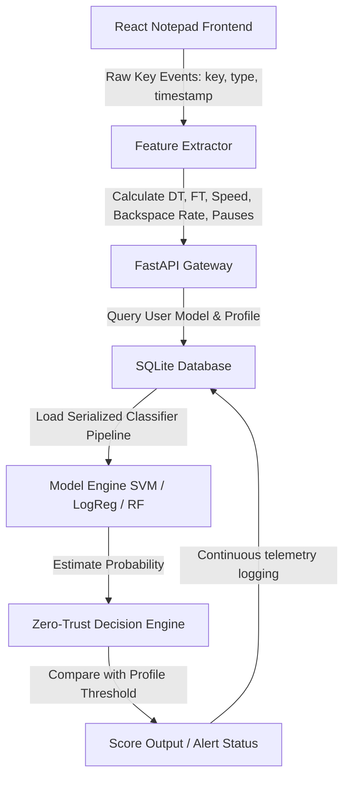

# Cortex-Guard: Continuous Behavioral Monitoring for Zero-Trust Architectures

> **Research prototype exploring how Palo Alto Networks could extend Cortex XDR with continuous endpoint telemetry analysis — using production-quality engineering patterns.**

**Problem:** Today's security stack verifies identity at login but assumes trust indefinitely thereafter — leaving active sessions vulnerable to hijacking, credential theft, and insider threats. The gap between initial MFA and continuous monitoring can allow an attacker to dwell undetected for **hours to days**.

**Solution:** A modular framework for continuous behavioral monitoring that evaluates real-time telemetry streams (beginning with keystroke dynamics) and provides a live risk score — reducing the potential dwell time of a compromised session from hours to **seconds**.

**Alignment with PANW Products:**
- 🟠 **Cortex XDR** — Endpoint behavioral telemetry ingestion and anomaly detection
- 🔵 **Prisma Access ZTNA** — Continuous "Never Trust, Always Verify" session scoring
- 🟢 **Strata NGFW** — Session anomaly alerts can trigger firewall policy changes and dynamic access control

---

## 🏗️ Architecture & Telemetry Pipeline



### Biometric Feature Extraction — O(n) Streaming Algorithm

The feature extraction pipeline processes keystroke events in a single linear pass O(n), designed for low-latency edge-agent compatibility (Cortex XDR lightweight agent model):

- **Dwell Time (DT)**: Duration a key is held down (`KeyUp − KeyDown`). Reflects neuromuscular individual signature.
- **Flight Time (FT)**: Interval between consecutive keystrokes (`KeyDown_current − KeyUp_previous`). Captures cognitive typing rhythm.
- **Typing Speed**: Completed keypresses per second — weighted rolling window.
- **Backspace Rate**: Ratio of mistake corrections (`Backspace_count / Total_keys`) capturing per-user accuracy profile.
- **Pause Frequency**: Count of inter-key gaps exceeding 1000ms — reveals thought patterns and fatigue.

---

## 📊 Machine Learning Benchmarks

Evaluated via Stratified 4-Fold Cross-Validation on genuine enrollment samples against a 25-user impostor cohort (`keystroke_behavioral_authentication_v3.csv`):

| Classifier | Accuracy | F1-Score | Equal Error Rate (EER) | EER Threshold | Inference Latency |
| :--- | :---: | :---: | :---: | :---: | :---: |
| **Logistic Regression** | 86.11% | 0.7161 | 15.83% | 0.53 | ~11.1 μs |
| **SVM (RBF Kernel)** | **94.44%** | **0.8167** | **7.50%** | **0.27** | **~13.3 μs** |
| **Random Forest** | 94.44% | 0.8167 | 10.83% | 0.22 | ~219.2 μs |

### Design Decision: SVM Selected as Primary Strategy

Although **Random Forest** matches SVM in validation accuracy, it carries an **18× latency overhead** (~219μs vs. ~13μs). In lightweight endpoint agent environments mirroring **Cortex XDR's** compute-constrained model, minimizing CPU cycles per inference is critical. **SVM (RBF)** achieves the best EER (7.5%) with microsecond-level latency — the right trade-off for always-on behavioral monitoring.

The Strategy Pattern in the codebase allows the model to be hot-swapped at runtime without restarting the service — intentional extensibility for research iteration.

---

## ⚙️ Operational Security Profiles

Operators configure the Zero-Trust policy threshold via three pre-built risk profiles, simulating the kind of adaptive access control policies in **Prisma Access**:

| Profile | Target | Use Case |
| :--- | :--- | :--- |
| **Balanced** (EER-Optimized) | FAR ≈ FRR | General workforce terminals |
| **High Security** (Low FAR ≤ 2%) | Minimize false accepts | High-value administrative / privileged access sessions |
| **Low Friction** (Low FRR ≤ 2%) | Minimize user interruptions | Low-risk internal productivity workloads |

---

## 🔗 Integration with Palo Alto Networks Products

This prototype is architected to align with PANW's product ecosystem:

| PANW Product | Integration Point | How Cortex-Guard Maps |
| :--- | :--- | :--- |
| **Cortex XDR** | Endpoint telemetry agent | Feature extraction + continuous session risk scoring |
| **Prisma Access ZTNA** | Identity-aware proxy | Per-session trust score fed into access decisions |
| **Strata NGFW** | Policy enforcement | Anomaly alerts trigger dynamic firewall policy changes, blocking lateral movement |
| **Cortex Data Lake** | Telemetry storage | Session logs → structured schema ready for CDL ingestion |

In a production deployment, the session score API (`POST /session/score`) output would be consumed by a Cortex XSOAR playbook to automatically trigger remediation — step-up MFA, session termination, or firewall quarantine.

---

## 👥 Designed for Team Development

The modular architecture enables **parallel development across engineering roles**:

```
behaviouralauthentication/
├── backend/
│   ├── app/
│   │   ├── features/       ← ML Engineer: feature engineering, new sensors
│   │   ├── models/         ← Data Scientist: classifier strategy, evaluation
│   │   ├── api/            ← Backend Engineer: endpoints, auth, rate limiting
│   │   └── storage/        ← Platform Engineer: database, schema, migrations
└── frontend/
    └── src/
        ├── components/     ← Frontend Engineer: UI panels, visualization
        └── services/       ← Frontend Engineer: API contract layer
```

- **Repository Pattern** decouples storage from business logic — swapping SQLite → PostgreSQL requires zero API changes
- **Strategy Pattern** allows ML model changes without touching the API layer
- **OpenAPI spec** (auto-generated at `/docs`) enables **contract-first development** between frontend and backend teams
- **Dockerized services** ensure environment parity across developer machines and CI/CD pipelines

---

## 🛠️ How to Run Locally

### Prerequisites
- Python 3.9+ | Node.js 18+ | Docker & Docker Compose (optional)

### Option 1: Docker Compose (Quickstart)
```bash
docker-compose up --build
```
- Dashboard: `http://localhost`
- API + Swagger UI: `http://localhost:8000/docs`

> Containerized for cloud deployment — readily extensible to AWS ECS, EKS, or GCP Cloud Run with minimal config changes.

### Option 2: Local Development

**Backend (FastAPI):**
```bash
cd backend
pip install -r requirements.txt
python -m uvicorn app.main:app --reload --host 127.0.0.1 --port 8000
```

**Run Tests & Simulation:**
```bash
# Unit tests (pytest)
python -m pytest backend/tests -v

# Threshold profiling & FAR/FRR simulation
python backend/scripts/simulate_data.py
```

**Frontend (React + TypeScript):**
```bash
cd frontend
npm install
npm run dev
# Open http://localhost:5173
```

---

## 📊 ML Pipeline Test Results

```
backend/tests/test_pipeline.py::test_feature_extractor         PASSED
backend/tests/test_pipeline.py::test_model_train_predict       PASSED
backend/tests/test_pipeline.py::test_threshold_profiles        PASSED
backend/tests/test_pipeline.py::test_far_frr_balanced          PASSED
```

---

## ⚠️ Honest Limitations & Production Path

This is a **research prototype**, not a production security tool. Honest assessment:

| Limitation | Production Mitigation |
| :--- | :--- |
| Keystroke dynamics alone has ~7.5% EER | Fuse with mouse dynamics, scroll patterns, and behavioral baseline (multi-modal biometrics) |
| SQLite not suited for high-concurrency | Swap to PostgreSQL via Repository pattern (zero API changes required) |
| No hardware security module (HSM) | Enroll biometric templates with HSM-backed encryption in production |
| Prototype dataset (25 users) | Validate on CMU Keystroke dataset (30,000+ samples) for production readiness |

The architecture is explicitly designed to plug in additional telemetry sensors — the `FeatureExtractor` is modular and the Strategy pattern means new classifiers can be added without touching the API.

---

## 📝 A Note on Synthetic Data

To demonstrate the enrollment and verification pipeline without compromising personal biometric data, the system uses a typing simulator that generates genuine enrollment samples around an individual's typing speed, pause rate, and dwell time profile. The provided `keystroke_behavioral_authentication_v3.csv` dataset (25 users) serves as the impostor cohort for FAR/FRR evaluation. Live typing from the React frontend captures real keyboard events and scores them against the trained model in real time.
